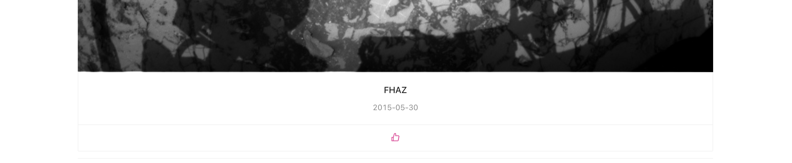

# Shopify Challenge - Frontend Developer Intern
## Available Scripts

In the project directory, you can run:

### `yarn start`

Runs the app in the development mode.\
Open [http://localhost:3000](http://localhost:3000) to view it in the browser.

## Deployment on Github Pages

[https://xqiu1.github.io/ShopifyChallenge/](https://xqiu1.github.io/ShopifyChallenge/)

## Screenshots

### Overview

### You can click the like icon to like or unlike the picture

### You can always click `load more` at the end of the page to load more pictures from NASA

